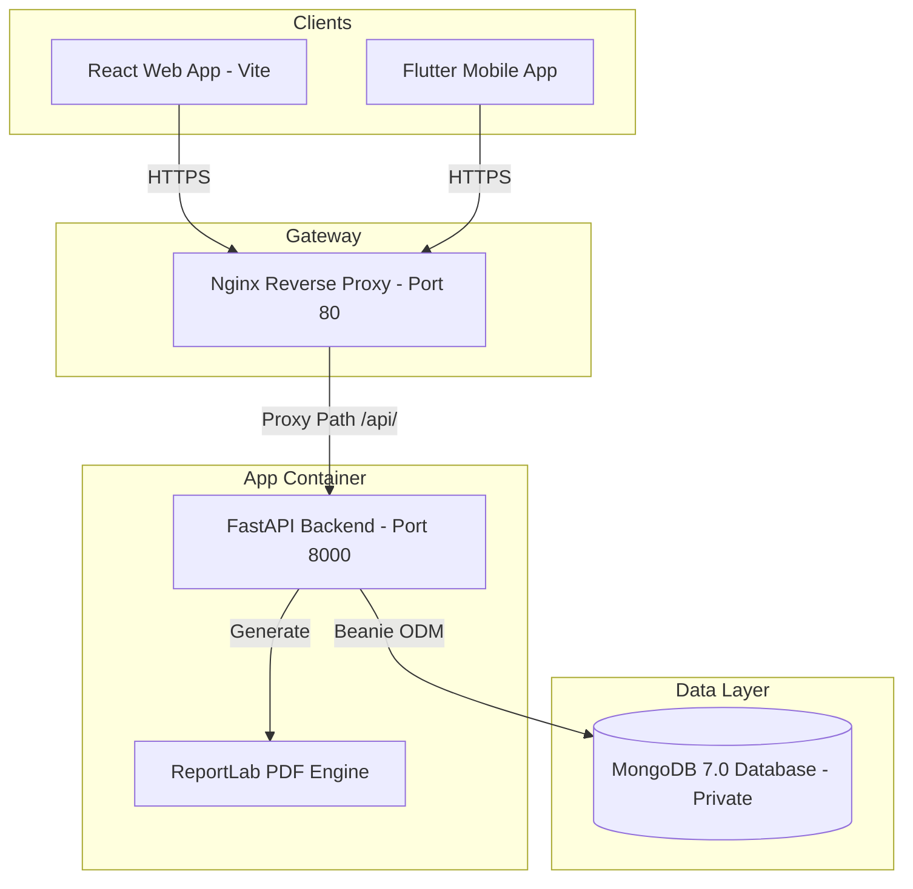

# Project Documentation: Invoice Digital Viyabari

Welcome to the technical and functional documentation of **Invoice Digital Viyabari**—a robust, multi-tenant SaaS Invoice Management and Expense Tracking system designed for small and medium-sized enterprises (SMEs), retail merchants, freelancers, and service providers. 

This document serves as a complete technical guide detailing the project's features, application architecture, technology stack, and deployment environment.

---

## 📌 Table of Contents
1. [General System Overview](#1-general-system-overview)
2. [Functional Business Features](#2-functional-business-features)
3. [Technology Stack & Architecture](#3-technology-stack--architecture)
   - [FastAPI Backend REST API](#a-fastapi-backend-rest-api)
   - [React Web Portal](#b-react-web-portal)
   - [Flutter Mobile Companion App](#c-flutter-mobile-companion-app)
4. [DevOps & VPS Deployment Infrastructure](#4-devops--vps-deployment-infrastructure)
5. [Database Entity Schema Reference](#5-database-entity-schema-reference)

---

## 1. General System Overview

**Invoice Digital Viyabari** is a multi-platform billing suite that enables business owners to manage inventories, generate tax-compliant PDF invoices, send quotations, record client payments, track operational expenses, and review business performance. It features a hierarchical multi-tenant access control model containing Super Admins, Organization Admins, and Regular Users.

---

## 2. Functional Business Features

### 👤 Customer (Client) Management
* **Rich Client Profile**: Supports billing name, company title, contact person, mobile number, dedicated WhatsApp contact line, email, billing address, shipping address, state, and client-specific GSTIN.
* **Transaction Histories**: Logs a full audit trail of invoices, quotations, proforma documents, and payments mapped to each specific customer.

### 📦 Product & Service Catalog
* **Item Categorization**: Handles physical products and digital/consulting services.
* **Pricing & Tax Structures**: Stores selling price, pricing units (e.g., Units, Kgs, Hours), HSN/SAC codes, and tax eligibility states (inclusive/exclusive of GST).
* **Discount System**: Embeds standard discounts on item lines configured by absolute amount or percentage.
* **Real-time Stock Control**: Decrements stock levels automatically when transactions are finalized.

### 📈 Transactions & Billing Engine
* **Tax Invoices**: Generates professional invoices, automatically calculating sub-totals, discount subtractions, SGST/CGST/IGST divisions, and final grand totals.
* **Quotation (Estimate) Builder**: Sends drafts and official quotations to prospects. Supports **one-click conversion** of a quotation into a full Tax Invoice upon customer approval.
* **Proforma Invoices**: Pre-billing documents. Allows **one-click conversion** into a final Tax Invoice, which immediately triggers inventory stock adjustments.
* **Dynamic PDF Generator**: Assembles clean, branded A4 pages with payment details, custom brand colors, business logos, digital signatures, and automated number-to-words currency conversion (INR Rupees).

### 🧾 Business Expense Tracker
* **Categorization**: Groups spending into custom categories (e.g., Petrol, Travel, Office Supplies, Dinner).
* **Payment Log**: Traces transactions across payment channels (Cash, UPI, Bank Transfer, Card).
* **Date Filters**: Filters operational costs daily, monthly, or by custom date spans to maintain strict cash flow oversight.

### 💰 Payment Records
* **Invoice Linking**: Records partial or full payments on active invoices. Updates status flags (Unpaid $\rightarrow$ Partial $\rightarrow$ Paid) automatically.
* **Unlinked Payments**: Allows logging general deposits or business receipts not tied to specific invoices.

### 🔐 User Roles & Tenant Control
* **Super Admin**: Manages SaaS subscription plans (Free Trial, Basic, Premium, Enterprise), activates or disables tenant access, and views overall platform revenue statistics.
* **Admin (Organization Owner)**: Regulates subordinate team accounts, registers staff members, and accesses aggregated team-wide billing reports.
* **Regular User (Merchant/Staff)**: Updates personal company profile, configures bank payment details (IFSC, Account Number, UPI ID), uploads company logo/signature, and handles standard store operations.

### ⏳ 7-Day Free Trial & Subscription Controls
The backend maintains strict multi-tenant access control and trial period restrictions to manage access and monetization:
1. **7-Day Automatic Trial Creation**: Upon user/organization registration, if no subscription record is found, the system automatically creates a `Subscription` record with `PlanType.FREE_TRIAL` set to expire exactly **7 days** from creation.
2. **Expired State Handling**:
   * If a user tries to access backend endpoints after the 7 days have passed (and they do not have `has_full_access` enabled), the backend throws a `402 Payment Required` (Subscription Expired) exception.
3. **Admin/Super Admin Approval Override**:
   * Standard users can request full, unlimited access.
   * Admins or Super Admins can grant unlimited access by calling `PATCH /admin/users/{user_id}/access` to set `has_full_access` to `true`.
   * Standard users who are granted `has_full_access` are exempt from trial expiration gates.
4. **Post-Trial Restricted Mode (1 Creation/Day Limit)**:
   * When standard users exceed their trial end-date and do not have an active subscription or `has_full_access` enabled, they transition into a restricted mode.
   * In restricted mode, they are blocked from creating more than **1 resource per day** of invoices, products, clients, quotations, payments, or proforma invoices.
   * If they attempt to create a second resource, the backend throws a `403 Forbidden` error: *"Trial Limit Reached: You can only create 1 {action_type} per day in trial mode. Please upgrade for unlimited access."*

---

## 3. Technology Stack & Architecture

### A. FastAPI Backend REST API
* **Base Framework**: **FastAPI** (Python 3) using asynchronous `async`/`await` event loops for high-concurrency requests.
* **Database Driver**: **Beanie ODM** (Object Document Mapper) built on top of `Motor` (async driver) and `Pydantic v2` for type validation.
* **Security & Sessions**:
  * Passwords hashed using secure **bcrypt** algorithms.
  * **OAuth2 JWT Token Authentication**.
  * **Enforced Single Active Session**: Injects a unique session UUID into the JWT. When a user logs in on a new device, a new session ID is generated in the database. Any requests containing old JWT session IDs are rejected with a session-expired exception.
  * Captures client IP addresses and user-agent string data on logins for security checks.
* **PDF Generator**: Built using the **ReportLab** library to render A4 invoices:
  * Dynamically fetches company logo images and digital signature graphics.
  * Renders bank payment details, custom notes, terms, and conditions.
  * Returns binary streams directly to clients using FastAPI `Response`.

### B. React Web Portal
* **Engine**: **React 19** + **Vite 8** for lightning-fast bundling, Hot Module Replacement (HMR), and optimal asset distribution.
* **Routing**: **React Router v7** with route-guard middleware protecting authenticated zones.
* **Styling**: Structured **Vanilla CSS** with HSL variables, allowing flexible color themes and UI alignment.
* **Animations**: **Framer Motion** for elegant sidebar, modal, loading, and navigation transitions.
* **Data Fetching**: **Axios** client configured with automatic request interceptors that inject headers and intercept `401 Unauthorized` responses to handle expired sessions.

### C. Flutter Mobile Companion App
* **Core Engine**: **Flutter SDK** (Dart) for high-performance compile targets on Android and iOS.
* **State Management**: **Riverpod** (`flutter_riverpod`) enforcing clean, unidirectional data flows and state decoupling.
* **Navigation**: **GoRouter** providing declarative route patterns.
* **Secure Storage**: **Flutter Secure Storage** for encrypted storage of JWT keys, alongside **Shared Preferences** for cache flags.
* **Networking**: **Dio** client featuring custom interceptors for token attachment and network failure logging.
* **Charts**: **FL Chart** for drawing visual statistics, expense categories, and sales trends.
* **Native Integrations**:
  * **Biometric Lock** (`local_auth`): Login protection via Fingerprint or Face ID.
  * **Share Sheet** (`share_plus`): Quick-shares PDF invoices directly to WhatsApp or Email.
  * **PDF Viewer** (`flutter_pdfview`): Inspects generated invoices locally in-app.
  * **Camera & Gallery Picker** (`image_picker`): Simple logo and signature image uploads.
  * **Branding Color Picker** (`flutter_colorpicker`): In-app color selection for branding.

---

## 4. DevOps & VPS Deployment Infrastructure

The production system is deployed on a **Hostinger VPS (Ubuntu Jammy)** using a fully automated deployment architecture.

### 🐳 Containerization & Process Manager
* Multi-stage Docker builds separate frontend compilation stages from execution environments.
* **Docker Compose** (`docker-compose.prod.yml`) binds the backend container (Port 8000) and frontend container (Port 3000) inside an isolated bridge network (`invoice_net`).
* A host-level **Systemd service** (`invoice-app.service`) manages startup orders, reboot recoveries, and graceful shutdowns.

### 🌐 Reverse Proxy & Security Hardening
* **Nginx**: Operates on port 80 as a reverse proxy.
  * Proxies `/api/` to the FastAPI container (stripping prefix).
  * Proxies root `/` traffic to the React static container.
  * Compresses payloads dynamically using **Gzip** rules.
* **Security Headers**: Enforces `X-Frame-Options: SAMEORIGIN`, `X-Content-Type-Options: nosniff`, and `X-XSS-Protection` globally.
* **Rate Limiting**: Enforced via Nginx zones:
  * General API: Limited to 30 requests/minute (burst: 20).
  * Authentication `/api/auth/login`: Limited to 5 requests/minute (burst: 5) to protect against brute-force attacks.
* **UFW Firewall**: Restricts all inbound ports except SSH (22) and HTTP (80). Keeps MongoDB (27017) completely private and inaccessible from the public internet.
* **Fail2ban**: Monitors system logs and blocks persistent invalid SSH login attempts.

### 💾 Backup Strategy
* A scheduled cron job executes a database dump script daily at **2:00 AM**.
* Extracts database contents using `mongodump`, compresses them into `.tar.gz` archives, and stores them in `/opt/backups/mongodb/`.
* **Automatic Retention Policy**:
  * Daily: Retained for 7 days.
  * Weekly: Retained for 4 weeks.
  * Monthly: Retained for 12 months.

---

## 5. Database Entity Schema Reference

The MongoDB document schemas are validated through Beanie documents. Below is the technical specification of the collections:

| Collection Name | Model Class | Key Fields | Description |
| :--- | :--- | :--- | :--- |
| `users` | `User` | `email`, `hashed_password`, `role`, `current_session_id`, `has_full_access` | Access levels, active sessions, and trial statuses. |
| `subscriptions` | `Subscription` | `user_id`, `plan_type`, `is_active`, `razorpay_payment_id` | Plan types (Free, Basic, Premium) and payment mappings. |
| `company_details` | `Company` | `name`, `address`, `gst_number`, `bank_name`, `logo_url`, `invoice_color` | Merchant branding, payment instructions, and bank credentials. |
| `clients` | `Client` | `company_name`, `mobile`, `address`, `gst_number`, `state` | Customer contact lists and billing addresses. |
| `products` | `Product` | `name`, `price`, `gst_percent`, `stock`, `item_type` | Inventory items, service items, and tax rates. |
| `invoices` | `Invoice` | `invoice_number`, `client_id`, `total_amount`, `paid_amount`, `status`, `items` | Core tax billing documents, status tracking, and inline items. |
| `quotations` | `Quotation` | `quotation_number`, `client_id`, `total_amount`, `status` | Commercial quotes convertible to tax invoices. |
| `proforma_invoices` | `ProformaInvoice` | `proforma_number`, `client_id`, `total_amount`, `status` | Pre-invoices convertible to tax invoices. |
| `payment_records` | `PaymentRecord` | `invoice_id`, `amount`, `payment_method`, `payment_date` | Logs payments on invoices or general business revenues. |
| `stock_adjustments` | `StockAdjustment` | `product_id`, `adjustment_type`, `quantity`, `reason` | History of inventory additions or manual subtractions. |
| `expenses` | `Expense` | `category`, `amount`, `payment_mode`, `date`, `notes` | Logs company cash expenditures. |

---

*Document compiled dynamically for the project repository.*
